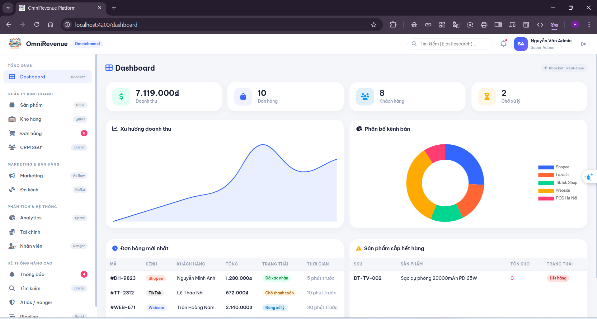
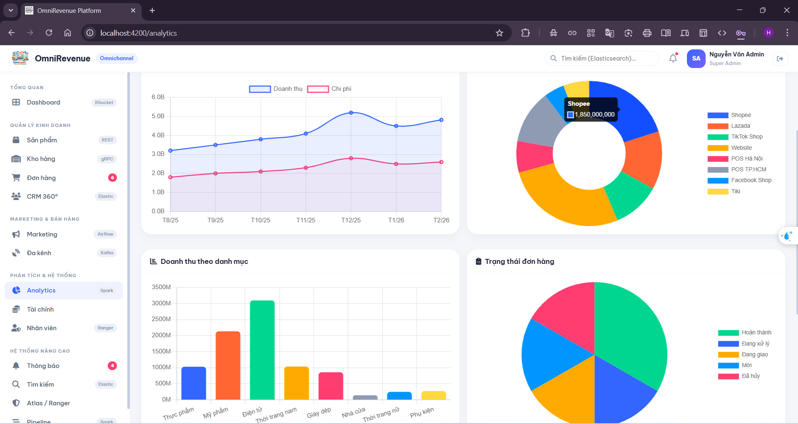
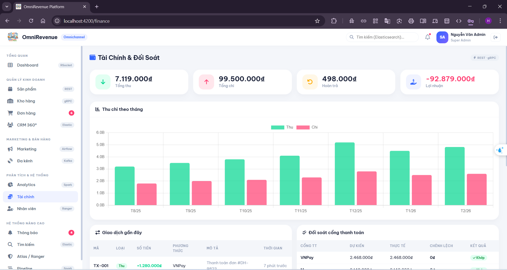
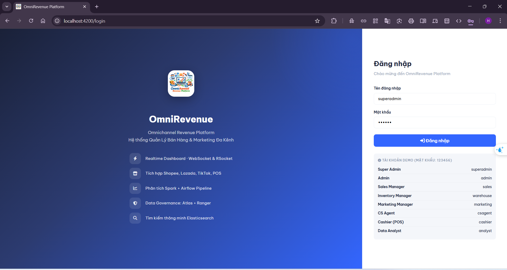

# OmniRevenue Platform
Hệ thống quản lý bán hàng đa kênh toàn diện — phục vụ 14 nghiệp vụ cốt lõi: Dashboard, Sản phẩm, Kho hàng, Đơn hàng, CRM 360°, Marketing, Đa kênh, Analytics, Tài chính, Nhân viên, Thông báo, Tìm kiếm, Data Governance, Pipeline.




**Frontend** chạy độc lập bằng mock data, sẵn sàng kết nối **15 microservices** backend chỉ bằng 1 dòng config.

```
Tech Stack
├── Frontend:   Angular 17 · Nebular UI · Chart.js · RxJS · TypeScript · SCSS · Signals
└── Backend:    Java 17 · Spring Boot 3 · Spring Cloud Gateway · PostgreSQL (11 databases)
                Apache Kafka · Redis · Elasticsearch · Spark · Airflow · Atlas · Ranger
                gRPC · WebSocket · Docker · Kubernetes
```

---

## Tài liệu

```
READ FIRST/              Đọc trước khi làm bất cứ việc gì
├── architecture.md        Kiến trúc microservices, quyết định thiết kế, sơ đồ giao tiếp
├── business-flows.md      8 luồng nghiệp vụ chính với sequence diagram chi tiết
└── rbac-matrix.md         3 lớp phân quyền: UI sidebar · API endpoint · data row/column

READ FRONTEND/           Dành cho frontend developer
├── frontend-structure.md  Cây file Angular 17, mapping TypeScript ↔ Java DTO, 8 tài khoản demo
└── mock-data.md           12 sản phẩm, 10 đơn hàng, 8 khách hàng, seed data khớp backend

READ BACKEND/            Dành cho backend developer
├── backend-structure.md   15 microservices, ports REST + gRPC, package structure chuẩn
├── api-contracts.md       60+ endpoints REST, pagination, error format, auth header
├── database-schema.md     11 PostgreSQL databases, DDL đầy đủ, indexes, naming conventions
├── grpc-contracts.md      5 proto files, 10 RPC methods, timeout, circuit breaker config
└── kafka-events.md        16 topics, payload JSON schema, partition strategy, DLQ config

READ DEPLOY/             Dành cho DevOps / người cài đặt
├── docker-compose.md      Toàn bộ hạ tầng 1 file: 11 DB + Kafka + Redis + Elasticsearch + Spark
├── coding-conventions.md  Quy tắc code Java · Angular · Git, PR checklist
├── testing-guide.md       Pyramid 70/20/5/5, coverage targets, Testcontainers, JaCoCo
├── troubleshooting.md     Debug startup · runtime · distributed tracing · symptom checklist
└── environment-window.md  Cài đặt toàn bộ môi trường trên Windows từ đầu
```

---

## Chạy nhanh (chỉ Frontend)

```bash
cd omnirevenue/frontend
npm install
npx ng serve
```

Mở http://localhost:4200 — đăng nhập bằng username và password `123456`.

**8 tài khoản demo:**

| Username | Role | Trang mặc định |
|---|---|---|
| `superadmin` | Super Admin | Dashboard |
| `admin` | Admin | Dashboard |
| `sales` | Sales Manager | Dashboard |
| `warehouse` | Inventory Manager | Kho hàng |
| `marketing` | Marketing Manager | Marketing |
| `csagent` | CS Agent | Đơn hàng |
| `cashier` | Cashier (POS) | Đơn hàng |
| `analyst` | Data Analyst | Analytics |

---

## Kết nối Backend

Frontend hiện dùng mock data nội bộ. Khi backend sẵn sàng, kết nối bằng cách sửa **2 file** theo thứ tự sau:

### Bước 1 — Sửa `auth.service.ts`

Đây là thay đổi quan trọng nhất. Hiện tại login đang so sánh hardcode với `DEMO_USERS` local.

```
src/app/core/services/auth.service.ts
```

Thay hàm `login()` từ:

```typescript
// TRƯỚC — so sánh local, không gọi API
login(username: string, password: string): boolean {
  const user = DEMO_USERS.find(u => u.username === username);
  if (user && password === '123456') {
    this.currentUser.set(user);
    localStorage.setItem('omni_user', JSON.stringify(user));
    ...
  }
}
```

Thành gọi `POST /api/v1/auth/login`, nhận JWT và lưu vào `localStorage` với key `omni_token`:

```typescript
// SAU — gọi API thật
login(username: string, password: string): Observable<boolean> {
  return this.http.post<{ token: string; user: User }>('/api/v1/auth/login', { username, password })
    .pipe(
      tap(res => {
        localStorage.setItem('omni_token', res.token);   // key phải là 'omni_token'
        localStorage.setItem('omni_user', JSON.stringify(res.user));
        this.currentUser.set(res.user);
        this.router.navigate(['/' + this.getFirstAllowedPage(res.user.role)]);
      }),
      map(() => true),
      catchError(() => of(false))
    );
}
```

> Token đã được `auth.interceptor.ts` tự động đính vào mọi request qua header `Authorization: Bearer <token>` — không cần thêm gì.

---

### Bước 2 — Thay mock data trong từng service

Mỗi domain service đang giữ một mảng `MOCK_*` và trả về qua signal local. Thay bằng `ApiService` đã có sẵn.

**Ví dụ với `product.service.ts`:**

```typescript
// TRƯỚC
getProducts() { return this.products(); }          // đọc signal local
getCategories() { return this.categories(); }

// SAU
getProducts(): Observable<Product[]> {
  return this.api.get<Product[]>('/products');
}
getCategories(): Observable<Category[]> {
  return this.api.get<Category[]>('/products/categories');
}
```

**Danh sách đầy đủ theo thứ tự nên làm:**

| File | Endpoint gốc | Method cần thay |
|---|---|---|
| `product.service.ts` | `/products` | `getProducts`, `getCategories`, `addProduct`, `updateProduct`, `deleteProduct` |
| `order.service.ts` | `/orders` | `getOrders`, `getOrder`, `updateStatus` |
| `customer.service.ts` | `/customers` | `getCustomers`, `getCustomer`, `getSegments`, `getLoyaltyTiers`, `getActivities`, `addCustomer`, `deleteCustomer` |
| `inventory.service.ts` | `/inventory` | `getWarehouses`, `getStockItems`, `getSuppliers`, `getPurchaseOrders`, `getTransfers`, `addSupplier`, `deleteSupplier` |
| `marketing.service.ts` | `/marketing` | `getCampaigns`, `getVouchers`, `addCampaign`, `addVoucher`, `deleteCampaign`, `deleteVoucher` |
| `channel.service.ts` | `/channels` | `getChannels`, `toggleChannel` |
| `staff.service.ts` | `/staff` | `getStaff`, `getShifts`, `getLeaderboard`, `addStaff`, `deleteStaff` |
| `finance.service.ts` | `/finance` | `getTransactions`, `getReconciliation`, `getSummary`, `getMonthlyData` |

---

### Bước 3 — Kết nối WebSocket (Thông báo real-time)

`notification.service.ts` hiện dùng mảng hardcode. Thay bằng WebSocket:

```typescript
// Kết nối tới ws://localhost:8080/ws?token=<jwt>
// Dùng environment.wsUrl đã có sẵn
const wsUrl = `${environment.wsUrl}?token=${localStorage.getItem('omni_token')}`;
```

---

### Không cần sửa gì thêm

`environment.ts` đã trỏ đúng tới backend — chỉ cần backend chạy đúng port:

```typescript
// src/environments/environment.ts — ĐÃ ĐÚNG, không cần sửa
export const environment = {
  production: false,
  apiUrl: 'http://localhost:8080/api/v1',   // API Gateway
  wsUrl:  'ws://localhost:8080/ws'           // WebSocket
};
```

`auth.interceptor.ts` đã tự động gắn JWT vào mọi request — không cần sửa.

